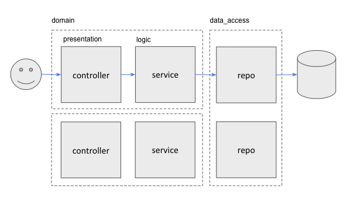

[](https://www.repostatus.org/#wip)

[](https://goreportcard.com/report/github.com/typical-go/typical-rest-server)
[](https://codebeat.co/projects/github-com-typical-go-typical-rest-server-master)
[](https://codecov.io/gh/typical-go/typical-rest-server)

# typical-rest-server

> The project status is `WIP` (Work in progress) which means the author continously evaluate and improve the project.

Pragmatic Golang RESTful Server Implementation
- Application
  - [x] [Go-Standards](https://github.com/golang-standards/project-layout) Project Layout 
  - [x] Environment Variable Configuration
  - [x] Health Check and Debug API
- Layered architecture
  - [x] Dependency Injection (using `@ctor` annotation)
  - [x] ORMHate
  - [x] Database Transaction
- RESTful Server
  - [x] [Echo framework](https://echo.labstack.com/)
  - [x] Standard CRUD
  - [x] Partially update resource (`PATCH` verb)
  - [x] Check resource (`HEAD` verb)
  - [x] RequestID in logger
  - [x] Offset Pagination
  - [ ] Server side caching (support `Cache-Control` header)
- Testing
  - [x] Table Driven Test
  - [x] Mocking (using `@mock` annotation)
- Others
  - [x] Database migration and seed tool
  - [x] Code generator for repository layer (using `@entity` annotation)


## Run/Test Project

The project using [typical-go](https://github.com/typical-go/typical-go) as its build-tool. The descriptor can be found in [tools/typical-build/typical-build.go](tools/typical-build/typical-build.go)

Edit `.env` to set the config
```bash
cp .env.sample .env    # copy the working .env
```

Run application:
```bash
./typicalw docker up   # equivalent with `docker-compose up -d`
./typicalw reset       # reset infra: drop, create and migrate postgres database 
./typicalw run         # run the application
```

Test application:
```bash
./typicalw mock        # generate mock (if new mock needed)
./typicalw test        # run test 
```

## Project Layout

Typical-Rest encourage [standard go project layout](https://github.com/golang-standards/project-layout)

Source codes:
- [`internal`](internal): private codes for the project
  - [`internal/app`](internal/app) 
    - [`internal/app/infra`](internal/app/infra): infrastructure for the project e.g. config and connection object
    - [`internal/app/domain`](internal/app/domain) 
      - [`internal/app/domain/mylibrary`](internal/app/domain/mylibrary)
        - [`internal/app/domain/mylibrary/controller`](internal/app/domain/mylibrary/controller): presentation for mylibrary domain
        - [`internal/app/domain/mylibrary/service`](internal/app/domain/mylibrary/service): logic for mylibrary domain
      - [`internal/app/domain/mymusic`](internal/app/domain/mymusic)
        - [`internal/app/domain/mymusic/controller`](internal/app/domain/mymusic/controller): presentation for mymusic domain
        - [`internal/app/domain/mymusic/service`](internal/app/domain/mymusic/service): logic for mymusic domain
    - [`internal/app/data_access`](internal/app/data_access)
      - [`internal/app/data_access/postgresdb`](internal/app/data_access/postgresdb): data access to postgresdb
      - [`internal/app/data_access/mysqldb`](internal/app/data_access/mysqldb): data access to postgresdb
  - [`internal/app/generated`](internal/generated): code generated e.g. typical, grpc, xsd, etc.
- [`pkg`](pkg): shareable codes e.g. helper/utitily Library
- [`cmd`](cmd): the main package

Others directory:
- [`tools`](tool) Supporting tool for the project e.g. Build Tool
- [`api`](api) Any related scripts for API e.g. api-model script (swagger, raml, etc) or client script
- [`databases`](database) Any related scripts for Databases e.g. migration scripts and seed data


## Layered Architecture



Typical-Rest encourage [layered architecture](https://en.wikipedia.org/wiki/Multitier_architecture) (as most adoptable architectural pattern) with [SOLID Principle](https://en.wikipedia.org/wiki/SOLID) 

- Presentation Layer at [`internal/app/domain/[DOMAIN]/controller`](internal/server/controller)
  - Handling HTTP routes
  - Parsing the request
  - Sending response (both success & error)
- Logic Layer at [`internal/app/domain/[DOMAIN]/service`](internal/server/service)
  - Intermediary between controller (end-point) and repository (data)
  - Logic of controller
  - Data Validation
  - DTO (Data Transfer Object) Model
- Data Access Layer at [`internal/app/data_access/[DATABASE]`](internal/server/repository)
  - No logic except operation to database
  - Repository pattern
  - DAO (Data Access Object) Model
  - Database Entity or Business Entity

## Dependency Injection

Typical-Rest encourage [dependency injection](https://en.wikipedia.org/wiki/Dependency_injection) using [uber-dig](https://github.com/uber-go/dig) and annotations (`@ctor` for constructor and `@dtor` for destructor).

```go
// OpenConn open new database connection
// @ctor
func OpenConn() *sql.DB{
}
```

```go
// CloseConn close the database connection
// @dtor
func CloseConn(db *sql.DB){
}
```

## Application Config

Typical-Rest encourage [application config with environment variables](https://12factor.net/config) using [envconfig](https://github.com/kelseyhightower/envconfig) and annotation (`@envconfig`). 

```go
type (
  // AppCfg application configuration
  // @envconfig (prefix:"APP")
  AppCfg struct {
    Address string `envconfig:"ADDRESS" default:":8089" required:"true"`
    Debug   bool   `envconfig:"DEBUG" default:"true"`
  }
)
```

Generate usage documentation ([USAGE.md](USAGE.md)) and .env file 
```go
// in typical-build

&typcfg.EnvconfigAnnotation{
  DotEnv:   ".env",     // generate .env file
  UsageDoc: "USAGE.md", // generate USAGE.md
}
```

## Mocking

Typical-Rest encourage [mocking](https://en.wikipedia.org/wiki/Mock_object) using [gomock](https://github.com/golang/mock) and annotation(`@mock`). 

```go
type(
  // Reader responsible to read
  // @mock
  Reader interface{
    Read() error
  }
)
```

Mock class will be generated in `*_mock` package

## Database Transaction

In `Repository` layer
```go
func (r *RepoImpl) Delete(ctx context.Context) (int64, error) {
  txn, err := dbtxn.Use(ctx, r.DB) // use transaction if begin detected 
  if err != nil {                  // create transaction error
      return -1, err
  }
  db := txn.DB                     // transaction object or database connection
  // result, err := ...
  if err != nil {
      txn.SetError(err)            // set the error and plan for rollback
      return -1, err
  }
  // ...
}
```

In `Service` layer
```go
func (s *SvcImpl) SomeOperation(ctx context.Context) error{
  // begin the transaction 
  // and commit/rollback in end function
  defer dbtxn.Begin(&ctx)()  
  // ...
}
```


## References

Golang:
- [Go Documentation](https://golang.org/doc/)
- [Go For Industrial Programming](https://peter.bourgon.org/go-for-industrial-programming/)
- [Uber Go Style Guide](https://github.com/uber-go/guide)
- [Go Code Review Comments](https://github.com/golang/go/wiki/CodeReviewComments)

RESTful API:
- [Best Practices for Designing a Pragmatic RESTful API](https://www.vinaysahni.com/best-practices-for-a-pragmatic-restful-api)

## Project Starter

To setup new project, please use [rest-project-starter](https://github.com/typical-go/rest-project-starter)
```bash
curl -s https://raw.githubusercontent.com/typical-go/rest-project-starter/master/setup.sh | bash -s [project_name] [package_name]
```

## License

This project is licensed under the MIT License - see the [LICENSE.md](LICENSE.md) file for details